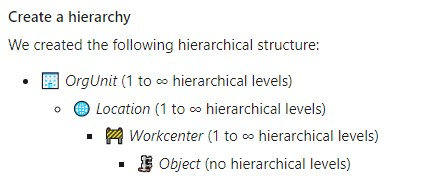

# Rules for creating Markdown in the repository

This document explains couple of rules to create a proper Markdown file we are used to use in various projects. Those rules help maintaining a great quality repository of files and a sain file structure. This allows as well to use the feature of `Wiki as Code` in `Azure DevOps`.

Markdown files are text based. If you want to learn about possibilities (headers, lists, tables, code and such) this cheat sheet was always helpful: [Markdown Cheatsheet · adam-p/markdown-here Wiki · GitHub](https://github.com/adam-p/markdown-here/wiki/Markdown-Cheatsheet). There are a number of them.

## Images and attachments

**All** images and attachments for anything stored in `/docs` **must** be stored in `/docs/.attachments`.

Reason: we are using [DocFX](https://dotnet.github.io/docfx/) to generate a static website. We only move attachments and pictures from `/docs/.attachments`. The rest is ignored.

## Naming conventions

Please to follow those simple rules:

- Try to only use lowercase in your names
- Don't use spaces, use `-`
- Use only ASCII 7 characters from the alphabet and numerical

## Links

It's ok to use external links.

For links on documentation itself, please use relative link to the file. For example if you are in `/docs/userdocs/en/plant-production` and want to reference the document `index.md` which is located in `/docs/userdocs`, the link will be `../../index.md`

## Markdown lint

We're using a Markdown link to make sure the Markdown is written properly. It runs when you do a PR and is giving you errors. Check more details [here](markdownlint.md).

## Practical Tips & Tricks

### Preview in VS Code

When editing markdown in VS Code, there is a preview button on the top right that will open a live preview window on the left. So you can type and see the result at the same time. This is usually a great way to avoid basic mistakes, making sure your images are showing up properly for example.


### Typora as an alternative tool

[Typora](https://typora.io/) is an online editor to help you generate proper Markdown. It can help you creating your first Markdown, get use to it. It also has great features like the ability to create table from a copy/paste of a web page. Be sensitive of the fact this is an online tool and of the confidentiality of the information you may put into this tool.

### Run markdownlint before pushing

To make sure before you push, run the markdownlint tool on your md-file and solve all messages. This tool will be run in the pipeline to validate your Markdown files. Check more details [here](markdownlint.md).

**Important**: There won't be any merge possible if the Markdown file is **not** properly formed. So it is very important to run the linter before you do a PR and fix all the issues.

### Use a spell checker

You have plenty of Spell checker extensions, they will reduce the numbers of mistakes. We can recommend you in VS Code, `Spell Right` or `Code Spell Checker` extensions.

### Patterns for enumerations

It can be a bit frustrating when working on markdown and when you try to work with enumerations. One of the key point to keep in mind is that enumerations in markdown and in generals are made to be grouped. Once you need a lot of text or code blocks in between, enumerations are not really the best. So here are couple of patterns.

```markdown
# This is the one and only main title

## You can have as many title 2 as you want

1. My enumeration starts with 1
  - I have sub bullets which can be enums as well
  - And another one
1. This one will have number 2
1. And you can guess, this one is 3

1. Now, this one is 1 again as there is a career return between both enums
1. And 2 again

```

If you are trying to get a large block of text with paragraphs and block of code, use the `Step #` pattern like this:

```markdown

- Step 1: do something

Here you may have a lot of blabla, some text code block, images, etc.

- Step 2: do the next step

Same here, a lot of things here.

- Step 3: you can continue this pattern

```

### Adding an Emoji into markdown file

It can be a great way to bring essential content to the point if you add some Emojis into markdown content. To add them use the next shortcuts depends on your operational system:

- on Mac: CTRL + CMD + Space
- on Windows: Win + ; (semi-colon) or Win + . (period)



## Moving files

In general, try **not** to move the files. There are a lot of links in files pointing to each others.

In case you want to change files, here is a process to catch broken link:

- Once you'll move your file in your own branch, push your branch in the repository
- Once pushed, run the [Documentation-automatic-creation pipeline](TODO: place the properlink on the pipeline sample)
- Open the DocFX task result and check the logs, it will contain broken links
- Correct the broken files
- Push back the changes
- Make your PR
