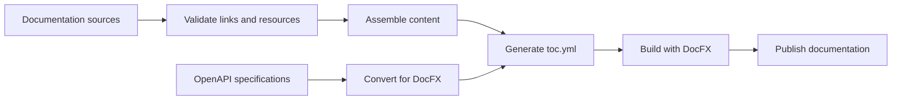

# DocFX Companion Tools

[](https://github.com/Ellerbach/docfx-companion-tools/actions/workflows/build.yml)
[](https://github.com/Ellerbach/docfx-companion-tools/releases)
[](LICENSE)

Build reliable documentation pipelines around [DocFX](https://dotnet.github.io/docfx/) with focused command-line tools for assembling content, validating links, generating navigation, translating pages, and preparing OpenAPI specifications.

Use one tool to solve a specific documentation problem, or combine them into a repeatable CI/CD workflow.

## Support the project

If these tools improve your documentation workflow, you can [sponsor ongoing development and maintenance](https://github.com/sponsors/ellerbach).

## Choose a tool

| When you need to... | Use | What it does |
| --- | --- | --- |
| Combine documentation from multiple repositories or folders | 🧩 [DocAssembler](./src/DocAssembler) | Collects and restructures content, rewrites links, and applies configurable path or content replacements. |
| Generate DocFX navigation from a folder hierarchy | 🗂️ [DocFxTocGenerator](./src/DocFxTocGenerator) | Creates one or more `toc.yml` files with configurable ordering, titles, folder references, and generated index pages. |
| Catch documentation problems before publishing | 🔎 [DocLinkChecker](./src/DocLinkChecker) | Validates local and external links, anchors, pipe tables, and resources; it can also report or remove orphaned attachments. |
| Keep multilingual documentation structures aligned | 🌐 [DocLanguageTranslator](./src/DocLanguageTranslator) | Finds missing localized files and translates complete documents or selected line ranges with Azure AI Translator. |
| Publish OpenAPI content through DocFX | 🔄 [DocFxOpenApi](./src/DocFxOpenApi) | Converts OpenAPI v2 or v3 JSON/YAML into the OpenAPI v2 JSON format expected by DocFX. |

Each tool has its own usage guide and command reference. All tools provide command-line help through `--help`.

## Quick start

The tools require the [.NET 10 runtime](https://dotnet.microsoft.com/download/dotnet/10.0). Install only the tools you need as global .NET tools:

```shell
dotnet tool install --global DocAssembler
dotnet tool install --global DocFxTocGenerator
dotnet tool install --global DocLinkChecker
dotnet tool install --global DocLanguageTranslator
dotnet tool install --global DocFxOpenApi
```

> [!TIP]
> If .NET 10 is not installed but a newer major .NET runtime is available, allow the tool to roll forward to that runtime:
>
> ```shell
> DocLinkChecker --roll-forward Major --docfolder ./docs
> ```
>
> The `--roll-forward Major` option works with any of the companion tools and must appear before the tool-specific arguments.
> Alternatively, set the `DOTNET_ROLL_FORWARD` environment variable. In PowerShell:
>
> ```powershell
> $env:DOTNET_ROLL_FORWARD = "Major"
> DocLinkChecker --docfolder ./docs
> ```
>
> In a Linux or macOS shell, set it for a single command:
>
> ```shell
> DOTNET_ROLL_FORWARD=Major DocLinkChecker --docfolder ./docs
> ```

For example, validate links, attachments, and tables, then generate a DocFX table of contents:

```shell
DocLinkChecker --docfolder ./docs --attachments --table
DocFxTocGenerator --docfolder ./docs --sequence --override --indexing NotExists
```

Non-zero exit codes make the tools suitable for validation gates in automated builds. See each tool's guide for its exact exit-code behavior.

## A typical documentation pipeline



The tools are independent, so the pipeline can start with the pieces that fit your repository. Translation can run before validation when localized documentation is part of the build.

## Installation options

### .NET tool

> [!NOTE]
> The tools are built for .NET 10 and expect the .NET 10 runtime to be installed. If only a newer major runtime is available, use the [roll-forward options](#quick-start) described above.

Install a single package globally:

```shell
dotnet tool install --global DocLinkChecker
```

Update it later with:

```shell
dotnet tool update --global DocLinkChecker
```

The package IDs match the tool names listed above.

### Chocolatey

Install all companion tools on Windows with [Chocolatey](https://chocolatey.org/install):

```powershell
choco install docfx-companion-tools
```

### GitHub release

Prebuilt Windows executables are available from [GitHub Releases](https://github.com/Ellerbach/docfx-companion-tools/releases). They are framework-dependent and require .NET 10.

## CI/CD examples

Ready-to-adapt Azure Pipelines examples are included in this repository:

- [Documentation validation](./PipelineExamples/documentation-validation.yml) uses Markdownlint and DocLinkChecker to validate Markdown, links, and attachments.
- [Documentation build](./PipelineExamples/documentation-build.yml) generates the table of contents, builds the DocFX site, and publishes it to Azure App Service.

## Docker

The Dockerfile can package any one of the tools. This example builds and runs DocLinkChecker:

```shell
docker build --tag doclinkchecker:latest --build-arg tool=DocLinkChecker -f Dockerfile .
```

When you mount a host directory for output or generated files, run the container with the same UID/GID as the host user so the non-root runtime can write to the bind mount.

PowerShell:

```powershell
docker run --rm --user 1654:1654 -v ${PWD}:/workspace doclinkchecker:latest -d /workspace
```

Linux or macOS:

```shell
docker run --rm --user "$(id -u):$(id -g)" -v "$(pwd):/workspace" doclinkchecker:latest -d /workspace
```

If you do not pass `--user`, use a writable directory inside the container or a bind mount whose ownership matches the container's non-root UID/GID; otherwise writes can fail with `Permission denied`.

## Documentation resources

The repository also contains reusable guidance and examples:

- [Markdown authoring guidelines](./DocExamples/docs/markdown-creation.md)
- [Markdownlint guidelines](./DocExamples/docs/markdownlint.md)
- [End-user documentation guidelines](./DocExamples/docs/enduser-documentation.md)
- [Mermaid and UI-specific elements](./DocExamples/docs/ui-specific-elements.md)

## Contributing

Issues and pull requests are welcome. Keep pull requests focused and add one or more of these labels when the change should appear in the changelog:

| Category | Labels |
| --- | --- |
| 🚀 Features | `feature`, `enhancement` |
| 🐛 Fixes | `fix`, `bug` |
| 📄 Documentation | `documentation` |

The repository requires the [.NET 10 SDK](https://dotnet.microsoft.com/download/dotnet/10.0). Build and package all tools from PowerShell with:

```powershell
.\build.ps1
```

The [Build & Test workflow](./.github/workflows/build.yml) restores, builds, and tests each solution individually. Release packaging is automated through the repository's **Release & Publish** workflow; maintainers can reproduce it with `pack.ps1` after running the build script.

## License

DocFX Companion Tools is licensed under the [MIT License](LICENSE). See [THIRD-PARTY-NOTICES.TXT](THIRD-PARTY-NOTICES.TXT) for third-party notices. Several tools originated from work done with [ZF](https://www.zf.com/).
