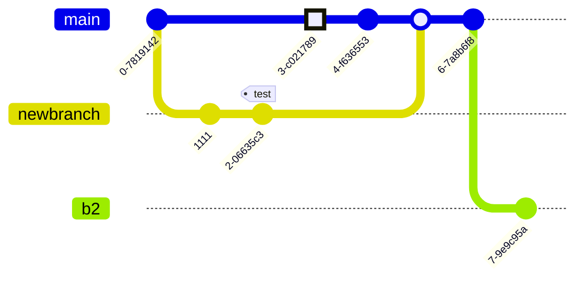

# Customize DocFx look and feel

Customizing the output of DocFx can be done using templates. In this repo we have a custom template that can be found in [/.docfx/template](../../.docfx/template). More information about customization can be found in [DocFx Documentation - Create a Custom Template](https://dotnet.github.io/docfx/tutorial/howto_create_custom_template.html).

## Adding support for Mermaid schemas

[Mermaid](https://github.com/mermaid-js/mermaid) is a nice way to get support for relational drawing, flowchart and diagram out of text. It is not supported out of the box by DocFX, you need to add this support. One of the best way is to customize the UI template and adjust the file in `partials/scripts.tmpl.partial` like this:

```js
{{!Copyright (c) Microsoft. All rights reserved. Licensed under the MIT license. See LICENSE file in the project root for full license information.}}

<script type="text/javascript" src="{{_rel}}styles/docfx.vendor.js"></script>
<script type="text/javascript" src="{{_rel}}styles/docfx.js"></script>
<script type="text/javascript" src="{{_rel}}styles/main.js"></script>

<!-- mermaid support -->
<script src="https://unpkg.com/mermaid@8.4/dist/mermaid.min.js"></script>
<script>
    mermaid.initialize({
        startOnLoad: false
    });

    window.onload = function () {
        const elements = document.getElementsByClassName("lang-mermaid");
        let index = 0;

        while (elements.length != 0) {
            let element = elements[0];
            mermaid.render('graph'+index, element.innerText, (svgGraph) => {                    
                element.parentElement.outerHTML = "<div class='mermaid'>" + svgGraph + "</div>";
            });
            ++index;
        }
    }
</script>
```

> [!NOTE]
> Like any other script, please don't forget to update the version regularly.

Here is a very simple Mermaid example:


